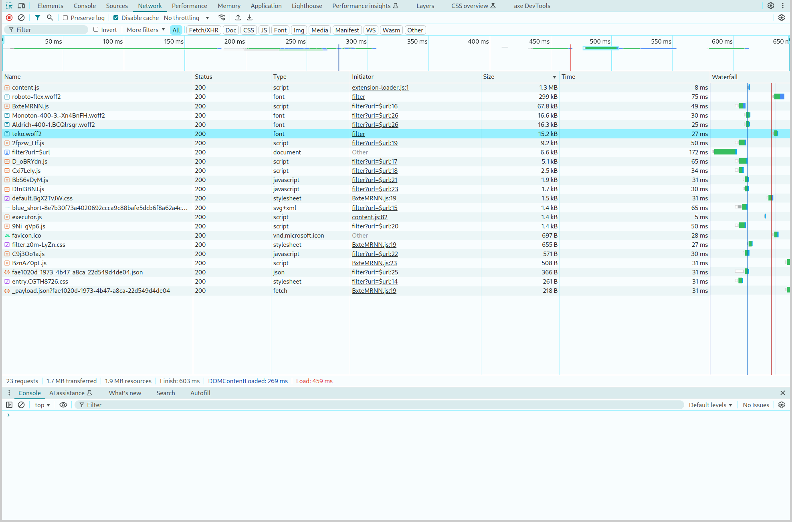

# TODOs

## 1.

- [x] Fix fonts (static loading, optimziation, cleanup, render blocking -> 0 flash)
- [x] Logo svg + mobile version "CScope" + Favicon
- [ ] Material color scheme & darkmode integration
- [ ] Material-like typography
- [ ] Mobile & Tablet Optimierung
- [ ] Cleanup, UI Verbesserungen, TODOS

## 2.

- [ ] Create basic filter page

## 3.

- [ ] Try to make full use of headlessui

## 4.

- [ ] Performance improvements (lazy loading of the modal for example)
  - [ ] Ensure proper lazy loading of components
  - [ ] All requests done properly?
  - [ ] All caching done properly?
  - [ ] All page rendering modes correct?
  - [ ] Check vercel options
  - [ ] Misc checks
  - [ ] Replace 'Roboto Flex' font... it's quite huge  But check how things perform once here. If page load is still < 1s, it could be ignored. Bench it without the font once at this point anyways.
- [ ] Do some SEO things

## 5.

- [ ] A11y
  - [ ] WAVE check
  - [ ] Maybe integrate axe

# 6. Tailwind

- [ ] Refactoring to Tailwind to see if it can hold up to it
